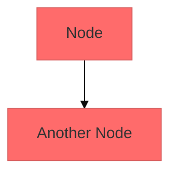
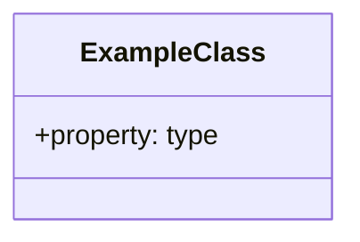

# Diagrammes FlashNotify

Ce dossier contient tous les diagrammes d'architecture du système FlashNotify au format Mermaid.

## Fichiers de Diagrammes

### 1. [architecture-overview.mmd](architecture-overview.mmd)
**Type** : Graph d'architecture
**Contenu** : Vue d'ensemble complète du système avec les différents composants
- Interface Web (Flask) et API (FastAPI)
- Backend et logique métier
- Base de données et tables
- Services externes (SMTP, Twilio, Push)
- Système d'authentification

### 2. [class-diagram-main.mmd](class-diagram-main.mmd)
**Type** : Diagramme de classes UML
**Contenu** : Structure des classes principales avec héritage multiple
- Mixins de canaux (SMS, Email, Push)
- Mixins utilitaires (Formatting, Archive, UserPreferences)
- Notificateur principal (AcademicNotifier)
- Relations d'héritage multiple

### 3. [class-diagram-metaclasses.mmd](class-diagram-metaclasses.mmd)
**Type** : Diagramme de classes UML
**Contenu** : Système de métaclasses et application aux classes
- Métaclasses (NotificationMeta, ChannelMeta, TemplateMeta, ConfigMeta)
- Application des métaclasses aux classes
- Relations d'auto-configuration

### 4. [sequence-notification.mmd](sequence-notification.mmd)
**Type** : Diagramme de séquence
**Contenu** : Processus d'envoi de notification étape par étape
- Interaction utilisateur → Flask → Queue → Worker
- Logique de priorité et distribution multi-canaux
- Archivage et retour de résultats

## Utilisation des Diagrammes

### Affichage dans Markdown
```markdown

```

### Rendu avec des outils

#### Mermaid Live Editor
1. Ouvrir https://mermaid.live
2. Coller le contenu du fichier .mmd
3. Le diagramme sera rendu automatiquement

#### VS Code avec extension Mermaid
1. Installer l'extension "Mermaid Preview"
2. Ouvrir le fichier .mmd
3. Utiliser la palette de commandes : "Mermaid: Open Preview"

#### GitHub/GitLab
Les fichiers .mmd sont automatiquement rendus dans les README.md

### Export vers d'autres formats

#### PNG
```bash
# Utiliser mmdc (Mermaid CLI)
npm install -g @mermaid-js/mermaid-cli
mmdc -i input.mmd -o output.png
```

#### SVG
```bash
mmdc -i input.mmd -o output.svg
```

#### PDF
```bash
mmdc -i input.mmd -o output.pdf
```

## Personnalisation

### Thèmes
Modifier les styles en ajoutant des directives Mermaid :


### Couleurs personnalisées


## Maintenance

### Ajout de nouveaux diagrammes
1. Créer un fichier `.mmd` descriptif
2. Ajouter la référence dans la liste ci-dessus
3. Tester le rendu avec un éditeur Mermaid

### Synchronisation avec le code
- Les diagrammes doivent refléter l'état actuel du code
- Mettre à jour lors de changements d'architecture significatifs
- Vérifier la cohérence entre diagrammes et documentation

## Standards

### Nommage
- Format : `type-diagram-name.mmd`
- Utiliser des noms descriptifs en anglais
- Préfixer par le type : `class-`, `sequence-`, `architecture-`

### Style
- Commentaires en français pour la lisibilité
- Indentation cohérente
- Labels descriptifs pour les participants

### Cohérence
- Les diagrammes doivent être complémentaires, pas redondants
- Maintenir la même terminologie entre tous les diagrammes
- Référencer les mêmes composants avec les mêmes noms
