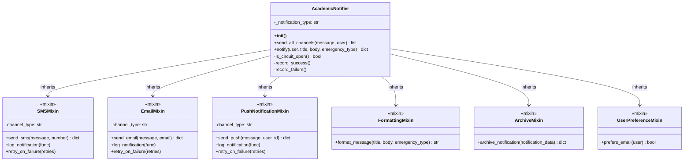

# Guide d'Architecture FlashNotify

## Vue d'Ensemble de l'Architecture

FlashNotify est une application de notification académique construite avec Flask et FastAPI, utilisant des concepts avancés de Programmation Orientée Aspects (POA) pour une architecture modulaire, extensible et robuste.

## Architecture Globale

### Stack Technique
- **Backend Principal**: Flask (Application Web)
- **API Avancée**: FastAPI
- **Base de Données**: SQLite avec SQLAlchemy ORM
- **Concepts Avancés**: Métaclasses, Décorateurs, Descripteurs, Mixins
- **Files d'Attente**: ThreadPoolExecutor + asyncio
- **Authentification**: JWT + API Key + Sessions

## Structure des Composants

### 1. Couche Core (`core/`)

Le module `core` contient tous les composants fondamentaux :

#### Système de Notification (`notification_system.py`)
- **AcademicNotifier** : Notificateur principal utilisant l'héritage multiple
- **Mixins** : 
  - `SMSMixin` : Envoi de SMS via API externe
  - `EmailMixin` : Envoi d'emails SMTP
  - `PushNotificationMixin` : Notifications push
  - `FormattingMixin` : Formatage des messages
  - `ArchiveMixin` : Archivage en base de données
  - `UserPreferenceMixin` : Gestion des préférences utilisateur

#### Métaclasses (`metaclasses.py`)
- **NotificationMeta** : Génère automatiquement les validateurs
- **ChannelMeta** : Gère l'enregistrement des canaux
- **TemplateMeta** : Système de templates
- **ConfigMeta** : Gestion de configuration dynamique

#### Décorateurs (`decorators.py`)
- **@add_performance_tracking** : Surveillance des performances
- **@auto_configuration_validation** : Validation automatique
- **@register_in_global_registry** : Enregistrement automatique
- **@add_circuit_breaker** : Protection contre les pannes

#### Descripteurs (`descriptors.py`)
- **EmailDescriptor** : Validation des emails
- **PhoneDescriptor** : Validation des numéros de téléphone
- **PriorityDescriptor** : Validation des priorités

### 2. Couche Modèles (`models.py`)

#### Modèles de Données
- **User** : Utilisateurs avec préférences et rôles
- **Notification** : Historique des notifications
- **PerformanceMetric** : Métriques de performance

### 3. Couche API (`api/`)

#### FastAPI Main (`api/main.py`)
- Routes API REST avec authentification
- Endpoints pour notifications avancées
- Documentation automatique OpenAPI

### 4. Couche Application Web (`app.py`)

#### Routes Flask
- Interface utilisateur web
- Gestion des sessions
- Tableau de bord administrateur

## Diagrammes d'Architecture

### Diagramme de Classes Principal



### Diagramme des Métaclasses


### Diagramme de Séquence - Envoi de Notification


## Patterns de Conception Utilisés

### 1. **Strategy Pattern**
- Différents canaux de notification (Email, SMS, Push)
- Stratégies de retry et circuit breaker

### 2. **Template Method Pattern**
- Méthodes communes de formatage et archivage
- Algorithmes de priorité personnalisables

### 3. **Decorator Pattern**
- Performance tracking
- Validation automatique
- Circuit breaker

### 4. **Registry Pattern**
- Enregistrement global des notificateurs
- Métaclasses pour auto-découverte

### 5. **Mixin Pattern**
- Réutilisation de fonctionnalités
- Héritage multiple contrôlé

## Flux de Données Principal

1. **Soumission** : Utilisateur soumet une notification via web ou API
2. **Validation** : Validation des données avec descripteurs
3. **Priorisation** : Calcul automatique de la priorité
4. **Distribution** : Envoi sur les canaux appropriés
5. **Archivage** : Sauvegarde en base de données
6. **Surveillance** : Métriques de performance

## Gestion des Performances

### Files d'Attente
- **ThreadPoolQueue** : Pour les opérations synchrones (Flask)
- **AsyncQueue** : Pour les opérations asynchrones (FastAPI)

### Circuit Breaker
- Protection contre les cascading failures
- Seuils configurables (max_failures=5, timeout=60s)
- Auto-réinitialisation

### Monitoring
- Temps de réponse par canal
- Taux de succès/échec
- Métriques de performance automatique

## Sécurité et Authentification

### Méthodes d'Authentification
1. **JWT Tokens** : Pour l'API FastAPI
2. **API Keys** : Pour l'accès programmatique
3. **Sessions** : Pour l'interface web

### Gestion des Rôles
- **Admin** : Accès complet
- **User** : Envoi de notifications
- **API_User** : Accès API uniquement

### Validation des Données
- Descripteurs pour validation automatique
- Métaclasses pour validation de configuration
- Circuit breaker pour protection externe

## Base de Données

### Modèles SQLAlchemy

#### User
```python
class User(db.Model):
    id: int (Primary Key)
    name: str (Required)
    email: str (Required, Validated)
    phone: str (Optional, Validated)
    password: str (Hashed)
    role: str (Default: 'user')
    prefers_email: bool (Default: True)
```

#### Notification
```python
class Notification(db.Model):
    id: int (Primary Key)
    user_id: int (Foreign Key)
    title: str (Required)
    body: str (Required)
    emergency_type: str (Enum)
    priority: str (Enum)
    channels: str (JSON)
    status: str (Default: 'sent')
    created_at: datetime
```

#### PerformanceMetric
```python
class PerformanceMetric(db.Model):
    id: int (Primary Key)
    method_name: str
    execution_time: float
    channel: str
    success: bool
    created_at: datetime
```

## Points Clés de l'Architecture

### 1. **Extensibilité**
- Ajout facile de nouveaux canaux via mixins
- Métaclasses pour auto-configuration
- Décorateurs pour fonctionnalités transverses

### 2. **Robustesse**
- Circuit breaker pour protection externe
- Retry automatique avec backoff
- Gestion d'erreurs complète

### 3. **Performance**
- Files d'attente asynchrones
- Thread pooling optimisé
- Métriques automatiques

### 4. **Maintenabilité**
- Séparation claire des responsabilités
- Patterns reconnus
- Documentation générée automatiquement

## Évolutions Futures

### Extensions Prévues
- Support WebSocket pour notifications temps réel
- Interface graphique avancée
- Système de templates pour messages
- Intégration avec services externes multiples

### Scalabilité
- Migration vers PostgreSQL
- Clustering des workers
- Cache Redis pour performances
- Microservices pour séparation des canaux

Cette architecture positionne FlashNotify comme un système robuste, extensible et maintenable, prêt pour une utilisation en production.
